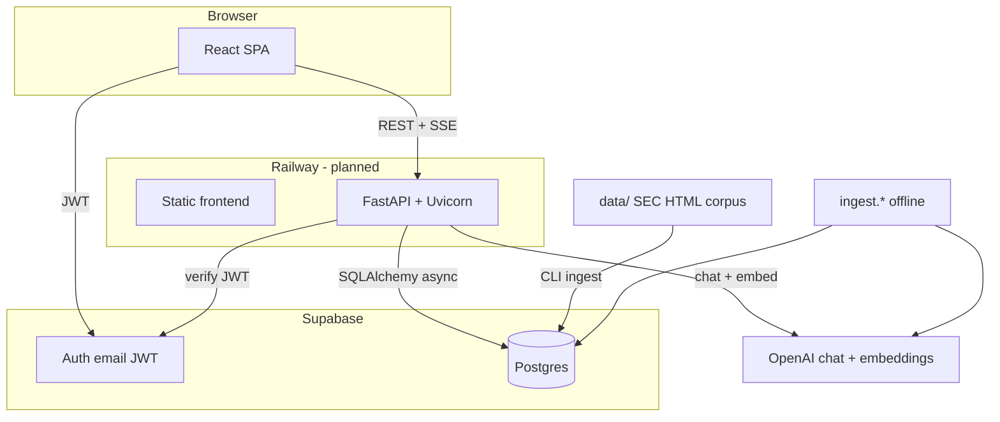

# Document Copilot — architecture (as built)

Internal research assistant for Driftwood Capital analysts. Answers come from a curated SEC 10-K corpus; every factual claim is meant to be verifiable via retrieved passages and citations. This document describes how the system is implemented today, not a future target design.

Related: [client brief](client-brief.md), [implementation checklist](todo.md), [AGENTS.md](../AGENTS.md).

## Trust model

- **Retrieval-first:** Each chat turn runs hybrid search over `document_chunks`, then the LLM sees only those passages (plus system rules).
- **Citations:** The model is instructed to cite with `[1]`, `[2]`, … matching retrieval labels. The backend validates labels, rewrites them to contiguous `[1]…[N]` for the UI, and persists citation rows with excerpts from chunk text.
- **Fail closed on bad grounding:** The model output is buffered. If citation validation fails, the client receives a controlled refusal message—not the unverified draft.
- **Honest limits:** Validator checks **label presence and membership** in retrieved passages, not semantic “does this sentence match the chunk.” Insufficient corpus evidence uses explicit refusal copy.

## High-level view



**Live path:** analyst → React → FastAPI → retrieve from Postgres → PydanticAI → validate → stream → persist threads/messages/citations.

**Offline path:** `data/download.py` → Docling HTML/Markdown → `load_documents` / `chunk_and_embed` → Postgres (no user traffic).

## Repository layout

```text
document-copilot/
├── data/                    # download script + gitignored filings
├── docs/                    # brief, architecture, todo, guides
├── backend/
│   ├── app/                 # FastAPI service (runtime)
│   ├── ingest/              # one-off corpus pipeline (CLI)
│   ├── alembic/             # migrations
│   └── tests/
└── frontend/
    └── src/                 # Vite React SPA
```

## Chat turn (sequence)

```mermaid
sequenceDiagram
    participant UI as ChatPage
    participant API as POST /chat/stream
    participant Orch as orchestrator
    participant Ret as DocumentRetriever
    participant DB as Postgres
    participant LLM as PydanticAI Agent
    participant Val as validator

    UI->>API: messages + Bearer JWT
    API->>API: require_owned_thread
    API->>Orch: stream_chat_turn
    Orch->>DB: persist user message
    Orch->>Ret: hybrid retrieve query
    Ret->>DB: vector + FTS + RRF
    alt no citable passages
        Orch->>UI: stream refusal
        Orch->>DB: persist assistant refusal
    else has evidence
        Orch->>LLM: stream to buffer only
        LLM-->>Orch: full text
        Orch->>Val: canonicalize_answer_citations
        alt validation ok
            Orch->>UI: stream canonical answer
            Orch->>DB: message + message_citations
        else
            Orch->>UI: stream grounding failure message
            Orch->>DB: persist refusal
        end
    end
```



Pipeline status events (`retrieval`, `generating`, `validating`, `refusal`, `done`) are sent as SSE `data-copilot-status` for the UI (`PipelineStatus`).

## Backend (`backend/app/`)

| Area | Role | Key modules |
|------|------|-------------|
| Entry | CORS, routers, `/health` | `main.py` |
| Config | Env via pydantic-settings | `config.py` |
| Auth | Bearer JWT → Supabase `get_user` | `auth/dependencies.py`, `auth/tokens.py` |
| API | Threads, messages, SSE chat | `api/chat.py`, `api/chat_schemas.py`, `api/auth.py` |
| Chat turn | One turn lifecycle | `chat/orchestrator.py`, `chat/grounding.py`, `chat/messages.py`, `chat/streaming.py`, `chat/status.py` |
| Assistant | PydanticAI agent (`output_type=str`) | `assistant/agent.py`, `assistant/instructions.py` |
| Retrieval | Hybrid search + RRF | `retrieval/retriever.py`, `retrieval/fusion.py`, `retrieval/embeddings.py`, `retrieval/types.py` |
| Grounding | Prompt formatting + citation policy | `grounding/context.py`, `grounding/validator.py`, `grounding/refusal.py` |
| Database | SQLAlchemy models + async session | `database/models.py`, `database/session.py`, `database/chats.py`, `database/documents.py` |

### Retrieval defaults

- Over-fetch **50** hits per channel (semantic + lexical), **RRF k=60**, return top **10** citable passages (`CANDIDATE_K`, `TOP_K` in `retriever.py`).
- **Neighbor chunks** are **off** by default (`RetrievalOptions.include_neighbors=False`). Enable for diagnostics only.
- Query embedding uses the configured OpenAI embedding model; chunk vectors live in `document_chunks.embedding` (pgvector HNSW).

### Grounding prompt

`format_grounding_system_addendum` includes **citable passages only** (labeled `[1]`…`[n]`). Chunk `content` is what analysts see in citation excerpts—indexed text from ingestion (Docling `contextualize`, including section headings when present).

### Persistence access pattern

Runtime chat and retrieval use **SQLAlchemy** with `DATABASE_URL` (async session). Supabase Auth validates users; **RLS policies exist in migrations** but the FastAPI path relies on **application-layer `user_id` filters** on threads and messages. Treat production DB credentials as privileged.

## Ingestion (`backend/ingest/`)

Offline CLI; not exposed on the HTTP API.

| Step | Module | Output |
|------|--------|--------|
| Download SEC HTML | `data/download.py` | `data/downloads/`, `manifest.json` |
| HTML → Markdown (inspect) | `ingest/to_markdown.py` | `data/markdown/` |
| Load Markdown | `ingest/load_documents.py` | `source_documents.markdown_content` |
| Chunk + embed | `ingest/chunk_and_embed.py` | `document_chunks` (+ embeddings, generated `search_vector`) |

Chunking re-parses **HTML** (not stored Markdown). Tables use **Markdown pipe serialization** via `ingest/docling_chunking.py` (not Docling’s default triplet `row, col = value` text). Re-chunking requires `chunk_and_embed --force`; see root [README](../README.md) for citation FK constraints.

Validation script: `python -m ingest._validate_phase3` (counts, indexes, sample retrieval, triplet-artifact sampling).

## Frontend (`frontend/src/`)

Plain **Vite + React SPA** (no Next.js). React Router in `App.tsx`.

| Concern | Location |
|---------|----------|
| Env | `lib/env.ts` |
| Supabase session | `lib/supabase.ts`, `lib/auth.ts` |
| HTTP + JWT | `lib/http.ts`, `lib/api.ts` |
| AI SDK transport + status SSE | `lib/chatTransport.ts`, `lib/chat.ts` |
| Chat UI | `pages/chat/*`, `components/chat/*` |
| Citations | `components/chat/CitationList.tsx`, `components/chat/Markdown.tsx` (inline `[n]` → source cards) |

Chat uses `@ai-sdk/react` with a custom transport pointing at `{VITE_API_BASE_URL}/chat/stream`. History and citations load from `GET /chat/threads/{id}/messages`.

## Data model (Postgres)

| Table | Purpose |
|-------|---------|
| `profiles` | One row per Supabase auth user |
| `chat_threads` | Owned by `user_id` |
| `chat_messages` | User/assistant content + optional AI SDK `payload` JSON |
| `message_citations` | `chunk_id`, excerpt (~500 chars), page, sort order; **FK to chunks RESTRICT** |
| `source_documents` | Filing metadata, SEC URL, full Markdown archive |
| `document_chunks` | Retrieval text, embedding, generated `search_vector`, JSON metadata |

Embeddings: **1536** dimensions (`text-embedding-3-small` unless config changes + migration).

## HTTP API (chat)

| Method | Path | Auth |
|--------|------|------|
| GET | `/chat/threads` | Bearer |
| POST | `/chat/threads` | Bearer |
| DELETE | `/chat/threads/{id}` | Bearer + owner |
| GET | `/chat/threads/{id}/messages` | Bearer + owner |
| POST | `/chat/stream` | Bearer + owner |

Stream body: AI SDK-style `messages` + `threadId`. Response: SSE, AI SDK UI message stream v1 headers.

Also: `GET /health`, auth helper routes under `api/auth.py`.

## Configuration

**Frontend** (`VITE_*`, validated in `lib/env.ts`): API base URL, Supabase URL, anon key.

**Backend** (`app/config.py`): Supabase URL/keys, `DATABASE_URL`, OpenAI keys/models/dimensions, `ALLOWED_ORIGINS`, `environment`.

Do not read raw env vars elsewhere in app code.

## Deployment shape (intended)

- **Railway:** two services — static frontend (`pnpm build` + SPA fallback) and backend (`uvicorn app.main:app --host 0.0.0.0 --port $PORT`).
- **Supabase:** hosted Postgres + Auth; run `alembic upgrade head` against the direct connection string before go-live.

Not yet checked in: `railway.toml`, production start scripts, CI. See [todo.md](todo.md) Phase 9–10.

## Stack summary

| Layer | Technology |
|-------|------------|
| Frontend | Vite, React 19, TypeScript, Tailwind, shadcn/ui, React Router, AI SDK UI |
| Backend | Python 3.12+, FastAPI, PydanticAI, SQLAlchemy 2 async, Alembic |
| Search | pgvector (HNSW) + Postgres FTS + RRF in Python |
| Auth | Supabase Auth (email), JWT on API |
| LLM | OpenAI chat model via PydanticAI |
| Ingestion | Docling (dev dependency), OpenAI embeddings batch |

## Explicit non-goals

- No browser-side OpenAI or service-role keys.
- No Next.js / SSR.
- No separate vector DB.
- No multi-tenant product model beyond per-user threads.
- No investment advice or external market feeds in scope.

## Manual verification

- Backend unit tests: `cd backend && uv run pytest -m "not integration"`.
- Analyst-style prompts: `uv run python smoke_assistant.py` (streams; compare with persisted thread in UI).
- Corpus sanity: `uv run python -m ingest._validate_phase3`.
